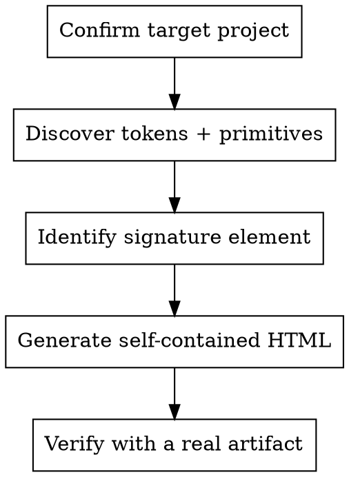

# Design System to HTML

## Overview

LLM-generated HTML artifacts default to a generic "well-designed dark dashboard" look that doesn't match any specific product. The cheapest way to make them feel on-brand is to extract the project's design system into a single self-contained `design-system.html` file, then have every future HTML prompt reference it.

**Core principle:** match the project's tokens, primitives, and one signature visual element. Tokens get you 60–70% of the brand, named primitive shapes get another 15–20%, and one inline-cloned signature element (a chamfered card, a bezeled sidebar, a distinctive gradient) is what makes the artifact read as *this product specifically*.

The output is a self-demonstrating file: it uses the tokens it documents, so it doubles as a working example.

## When to Use

- Starting an HTML artifact for a codebase with `globals.css` / `tailwind.config` / a component library — and wanting it to look on-brand
- User says "match our brand" or "look like our product" with no central style guide
- After seeing AI-generated HTML for a project that doesn't read as that product
- Before kicking off a series of design explorations (empty-state grids, mockup variants) where consistency matters
- User explicitly asks for a design system reference, brand kit, or `design-system.html`

## When NOT to Use

- Greenfield project with no tokens or components yet — use `frontend-design` to pick a direction first
- User wants to *build* a design system from scratch — use `tailwind-design-system` or `frontend-design`
- User wants to port standalone HTML *into* the project's tokens — use `port-page` (inverse direction)
- Project has no distinctive visual language worth extracting (e.g. raw shadcn defaults with no customization) — generating a reference adds little

## Workflow

### 1. Confirm target

- Confirm with the user where the output should land. Default: `<project-root>/design-system.html`.
- Confirm scope: are we documenting the design system as it exists, or as it *should* exist? This skill assumes the former. If the user wants the latter, they want `frontend-design` instead.

### 2. Discovery

Read every applicable file. See [references/discovery-checklist.md](references/discovery-checklist.md) for the full list with priority. The minimum is:

- The token file (`globals.css` / `tokens.css` / a `tailwind.config.{ts,js}` `theme.extend` block / a CSS-in-JS theme module)
- `components.json` if shadcn (style, baseColor, iconLibrary, aliases)
- The 5–10 most-imported primitive components (start with: button, card, badge, tabs, input, separator)
- One or two real composition components — actual product surfaces, not just primitives — to see how the system is used

If the project has a dedicated design-system app (e.g. `apps/design-system/`) or dev preview pages (e.g. `apps/web/app/dev/<component>/page.tsx`), read those — they're the highest-signal input.

### 3. Identify the signature element

Every product has one visual tic that *is* the brand. Without it, the artifact reads as "well-designed dark dashboard." With it, the artifact reads as "this product specifically." See [references/signature-elements.md](references/signature-elements.md) for heuristics.

Common signatures: a custom card shape (chamfered, bracketed, beveled), a distinctive gradient, a custom radius rhythm, a particular icon-stroke convention, a bespoke layout primitive (split-pane with a visible seam, magazine-style grid).

The signature element gets its own large section in the output. Reproduce it in pure HTML/CSS as faithfully as the source allows — read the React/Vue/Svelte component, extract the geometry math (clip-paths, SVG overlays, custom borders), and inline-CSS-clone it.

### 4. Generate

Produce a single self-contained HTML file at the agreed path. Inline all CSS (single `<style>` block at the top), inline all SVG, no external resources (no web fonts, no CDN scripts, no images).

The file is itself rendered using the tokens it documents — every color comes from the project's CSS vars, declared on `:root`. This is the self-demonstration property.

For section structure, see [references/output-template.md](references/output-template.md). At a minimum:

1. Header (kicker, H1, lead, last-generated date)
2. Tokens (colors, radii, type scale, spacing, with visible swatches/rulers)
3. Primitives gallery (buttons, cards, badges, tabs, inputs, separators)
4. Signature element (its own section, with raw shell + composed examples)
5. Composition examples (2–3 small assembled blocks showing how primitives combine in this product)
6. Iconography (12–16 inline icons at the project's stroke/size convention)
7. Voice + tone (4–6 lines, project-specific)
8. Use-me footer (the copy-pasteable instruction block for future prompts)

### 5. Verify

Open it in a browser. Ask:
- Does it read as the product, not a generic dashboard?
- Is the signature element faithful enough to anchor future artifacts?
- Are the tokens complete (no off-palette colors snuck in)?

Optional but recommended: regenerate one prior HTML artifact (an empty-state exploration, a mockup, a plan) using only `"Match design-system.html"` as the style brief — no token-pasting, no shape-naming. If that artifact looks at least as good as one prompted with explicit tokens, the reference is doing its job.

## Quality Bar

- **Self-contained** — single file, no external resources. Test by viewing offline.
- **Self-demonstrating** — uses the tokens it documents.
- **Faithful** — colors are exact (oklch / hex matched, not approximated). Shapes are exact (clip-path / radius matched).
- **Token-only** — no off-palette colors. If a section needs a color the project doesn't have, that's a discovery gap, not a license to invent.
- **Mobile-responsive** — readable at 400px viewport.
- **Under 100KB** — usually 40–80KB for typical projects.
- **The signature element is recognizable** — someone familiar with the product can identify it instantly.

## Using the Output

After generation, future prompts reference the file with one line:

> "Match the visual style of `<path>/design-system.html`. Use the tokens, primitives, and signature element documented there. Do not invent new colors or shapes."

Or even shorter once the pattern is established:

> "Match `design-system.html`."

This collapses the prompt overhead for every subsequent HTML artifact in the project (mockups, plans, explorations, brand kits, internal docs).

## Common Mistakes

- **Stopping at tokens.** Token-only design systems still feel generic — the signature element is what makes the artifact read as the product. Don't skip section 4.
- **Inventing tokens.** If the project's palette is missing a color you "need," document the gap, don't paper over it. The whole point is fidelity.
- **Over-generalizing.** This file is for *this* project. Don't soften the voice, don't broaden the palette, don't simplify the signature element to be more reusable.
- **Inlining the React source.** The artifact is HTML/CSS, not React. Reproduce shapes; don't paste JSX.
- **Skipping verification.** A reference file you never validate against a real artifact is just hopeful documentation. Always do step 5.
- **Using web fonts or CDN-hosted anything.** Single-file, offline-readable, or it's not a reliable reference.

## Regeneration

Regenerate when the design system changes meaningfully — new tokens, redesigned signature element, new primitive added to the public API. Small tweaks (a hex value shifting, a new button size) don't require regeneration; the existing file remains directionally correct.
