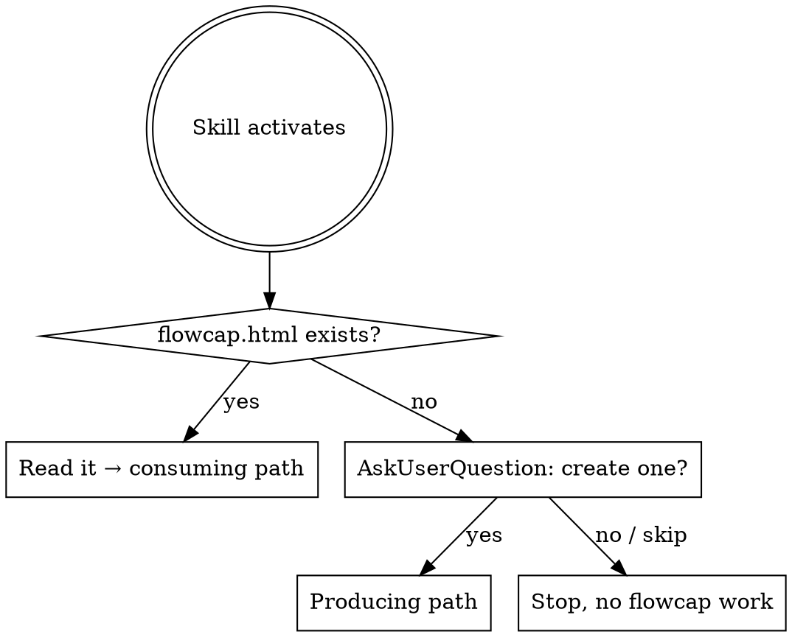

# flowcap

Document an app as **one self-contained HTML file** — an interactive swimlane diagram for humans, with the structured flow data embedded inside it as JSON for LLMs. One artifact, double-clickable, no server, no separate files.

The HTML reads its data from an inline `<script type="application/json" id="userflows">` block. Future agents extract that same block to load the flows into context.

## Entry routine — run this first, every time



**Step 1 — Look for the file.** Run:
```bash
find . \( -name flowcap.html -o -name userflows.json \) -not -path '*/node_modules/*' -not -path '*/.git/*' 2>/dev/null | head
```
(Also matches the legacy two-file layout — if you only find `userflows.json`, the project predates the single-file format.)

**Step 2a — Found it.** Read it whole. Jump to *Consuming* below. Do **not** ask first; just read it and let it inform your answer.

**Step 2b — Not found.** Before doing any other work, use the **AskUserQuestion** tool to ask the user whether to create one. Use this exact shape — one question, three options:

- **Question:** "No `flowcap.html` found in this repo. Want me to map the main flows now and drop a single self-contained `docs/flowcap.html` into the repo?"
- **Header:** `flowcap setup`
- **Options:**
  1. **Yes, build it now** — *"I'll read the codebase, propose 4–7 lanes and 3–8 flows, then write one HTML file with the data embedded."*
  2. **Not now, just this task** — *"Skip flowcap. Answer my current question without it."*
  3. **Never for this repo** — *"Don't ask again in this repo."* (When chosen, drop a `.flowcap-skip` sentinel file at the repo root so future invocations honor it.)

**Step 3 — Honor the answer.**
- *Yes* → jump to *Producing*.
- *Not now* → continue with whatever the user originally asked, no flowcap artifacts.
- *Never* → write `.flowcap-skip` (empty file at repo root), then continue. On future activations, treat presence of `.flowcap-skip` as "user said no, do not ask again" and proceed without flowcap.

**Don't skip the ask.** Producing a flowcap is a non-trivial write (repo-wide reading, one new file). It must be user-initiated, not silently triggered by the skill activating.

## When to use

- The user asks to document, diagram, map, or explain an app's architecture or flows.
- The user references this skill by name (`/flowcap`, "use flowcap", "make a flowcap").
- You're starting work in a repo that already has `userflows.json` — read it first.
- You're planning a feature or hunting a bug and the affected path is in `userflows.json` — load the relevant flow into context.

**Don't use for:** single-component diagrams, sequence diagrams of one function, throwaway sketches in a chat. Use Mermaid in markdown instead.

## Producing — generate one `flowcap.html` for a project

The output is **one file**. No build step, no helper scripts, no Python, no JSON sidecar. Copy the template, replace the embedded data block, write the file, done.

1. **Discover the system.** Read the repo: top-level dirs, package.json/Cargo.toml/etc., service boundaries, deploy config, external API calls. Don't guess — open files. If unsure, ask the user which user-facing flows matter (signup, build, checkout, etc.).
2. **Pick 4–7 swimlanes.** Lanes are categories of *where work happens*, left-to-right by typical data direction. Good lane sets: `Actors → Client surfaces → Server/Functions → Storage → Pipeline → Distribution → External services`. Use what fits the project.
3. **List nodes.** Each node = one concrete thing: a package, service, table, queue, third-party API. Title is the identifier developers would type (`@todesktop/cli`, `functions/builds`, `Firestore`). Subtitle is a one-line clarifier.
4. **Write 3–8 flows.** A flow is a user-visible or operationally-important journey. Each step is `{from, to, label, description}`. Description names the file/function and what payload moves — that's what makes the embedded JSON useful to future LLMs.
5. **Copy the template, replace the embedded JSON.** Read `template.html` from this skill, replace the contents of the `<script type="application/json" id="userflows">` block with the project data (validate against `schema.json`), and write the result to:
   ```
   docs/flowcap.html
   ```
   The HTML reads its data from that inline script tag — no fetch, no second file. The user can double-click it to open.
6. **Preview.** Just open the file: `open docs/flowcap.html` (macOS) or double-click in the file browser. Click each flow, verify edges land on the right nodes and step text reads naturally. **Do not** spin up `python3 -m http.server` or any other local server — the file works on `file://`.

Source files in this skill:
- `template.html` — drop-in viewer with an empty `<script id="userflows">` block to fill in. **Do not edit the viewer logic unless the user asks for a visual change.**
- `schema.json` — JSON Schema for the embedded data. Validate the JSON you write against it.
- `example.userflows.json` — reference example (ToDesktop). Use as a model for the data block; *do not* ship it as a separate file alongside the HTML.

## Consuming — when `flowcap.html` already exists

Before planning a feature, fixing a bug, or answering "how does X work" in this repo:

1. **Locate it.** `find . \( -name flowcap.html -o -name userflows.json \) -not -path '*/node_modules/*' | head`.
2. **Extract the embedded JSON.** Read `flowcap.html`, find the `<script type="application/json" id="userflows">...</script>` block, parse it. The data is compact by design — load the whole thing. (Legacy projects with a sibling `userflows.json` instead: read that directly.)
3. **Match the work to flows.** If the user's task touches a node listed in any flow, the relevant flow(s) are required context — quote step descriptions back when explaining the change.
4. **Update it when you change the system.** If a PR moves a step, renames a node, or adds a new flow, edit the embedded JSON inside `flowcap.html` in the same PR. Stale flow docs are worse than missing ones.

## Schema quick reference

```jsonc
{
  "project":  { "name": "...", "description": "..." },
  "defaults": { "autoSelectFirst": true },
  "lanes":    [ { "id": "fns", "label": "Functions", "color": "#a855f7" } ],
  "nodes":    [ { "id": "fns-builds", "lane": "fns", "title": "functions/builds", "subtitle": "15 fns" } ],
  "flows":    [ {
    "id": "build",
    "title": "todesktop build",
    "description": "Developer runs `todesktop build`.",
    "steps": [
      { "from": "td-cli", "to": "fns-builds", "label": "prepareNewBuild()",
        "description": "HTTP fn. Payload: appId, appVersion, projectConfig…" }
    ]
  } ]
}
```

All ids are kebab-case `^[a-z0-9-]+$`. Lane order = column order in the diagram. Steps reference nodes by id.

## Writing good flow descriptions

The `description` on each step is what makes the JSON LLM-useful. Aim for:

- **The file or function** that owns the edge (`packages/cli/src/utilities/firestore.ts`).
- **The payload or contract** that moves (`{ appId, appVersion, projectConfig }`).
- **The why** if it isn't obvious (`exchanges cached creds for an idToken`).

Skip flavor text. A developer should be able to grep the codebase from the description alone.

## Common mistakes

- **Lanes used as types instead of locations.** "React components" is not a lane; "Client surfaces" is. Lanes answer *where*, not *what*.
- **Nodes too coarse.** "Backend" is not a node. `functions/builds`, `functions/billing`, `functions/auth` are.
- **Steps that span multiple actions.** One arrow = one call/event/write. Split compound steps.
- **Writing helper scripts.** No Python generator, no Node script, no codegen. flowcap's entire output is one HTML file. If you're tempted to write a `generate_flows.py`, stop — just write the JSON inline.
- **Splitting the data back into a sibling file.** The JSON lives inside the HTML in a `<script id="userflows">` block. Don't `fetch()` it, don't emit a separate `userflows.json` next to it.
- **Editing `template.html` viewer logic to tweak per-project styling.** Don't. If you truly need a visual tweak, add a small `<style>` override at the bottom of the project's HTML — leave the script logic alone.
- **Forgetting to update the embedded JSON when the code changes.** Stale > missing. Treat the data block like a schema migration: any PR that moves a flow updates it in the same change.
- **Inventing the system.** If you don't know what a function does, read it or ask. Made-up flows poison every future agent that loads them.
