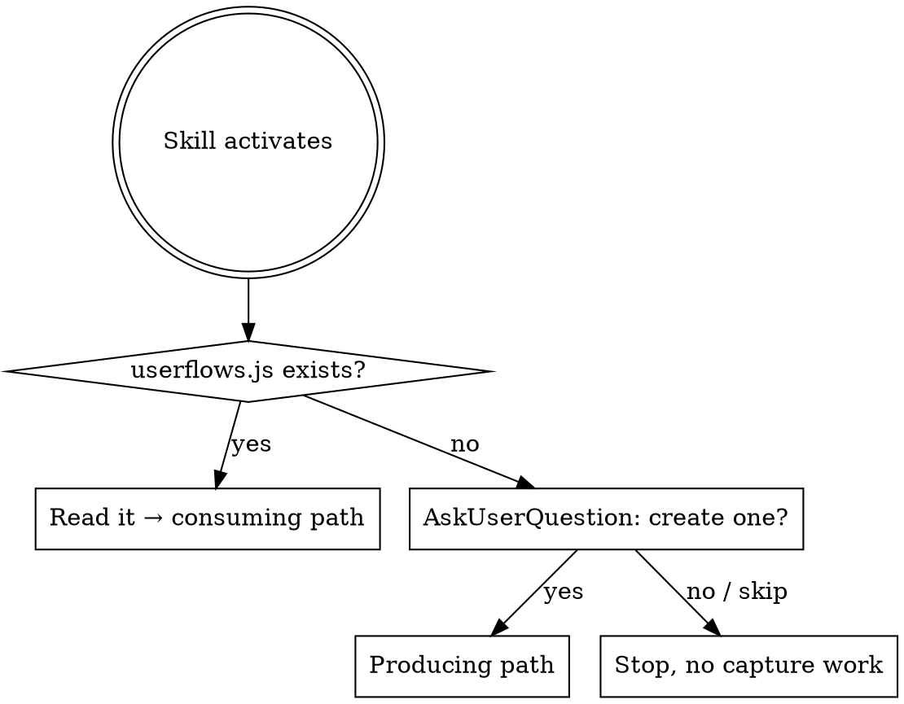

# userflow-capture

Document an app as a map of **user journeys** — the paths a real person takes through the product. Two side-by-side files:

```
docs/
  userflows.html   ← drop-in viewer (unmodified template)
  userflows.js     ← project data (defines window.USERFLOWS)
```

The HTML is for humans — an interactive swimlane diagram you can click through. The JS file is for future LLM agents — they read it before touching a feature or bugfix so they know what the *user* is trying to accomplish, not just what the code does.

Both files live next to each other. The HTML loads `./userflows.js` with a plain `<script src>`, so the page works on `file://` — double-click to open, no server.

**This is not an architecture diagram.** Lanes are not "Server / Database / API". Nodes are not Firestore tables or background jobs. Steps are not HTTP payloads. If a flow has no user touchpoint — a cron job, a webhook, a data migration — it does not belong here.

## Entry routine — run this first, every time



**Step 1 — Look for the file.** Run:
```bash
find . \( -name userflows.js -o -name userflows.json -o -name userflows.html -o -name flowcap.html \) -not -path '*/node_modules/*' -not -path '*/.git/*' 2>/dev/null | head
```
(Also matches legacy filenames from earlier versions of this skill. Treat any hit as "a userflow capture exists here".)

**Step 2a — Found it.** Read it whole. Jump to *Consuming* below. Do **not** ask first; just read it and let it inform your answer.

**Step 2b — Not found.** Before doing any other work, use the **AskUserQuestion** tool to ask whether to create one. Use this exact shape — one question, three options:

- **Question:** "No `userflows.js` found in this repo. Want me to map the main user journeys now and drop `docs/userflows.html` + `docs/userflows.js` into the repo?"
- **Header:** `userflow setup`
- **Options:**
  1. **Yes, build it now** — *"I'll propose 3–6 user journeys (signup, key feature, settings, etc.), then write both files."*
  2. **Not now, just this task** — *"Skip it. Answer my current question without it."*
  3. **Never for this repo** — *"Don't ask again in this repo."* (When chosen, drop a `.userflow-capture-skip` sentinel file at the repo root so future invocations honor it.)

**Step 3 — Honor the answer.**
- *Yes* → jump to *Producing*.
- *Not now* → continue with whatever the user originally asked, no capture artifacts.
- *Never* → write `.userflow-capture-skip` (empty file at repo root), then continue. On future activations, treat presence of `.userflow-capture-skip` as "user said no, do not ask again" and proceed without capture.

**Don't skip the ask.** Producing a userflow capture is a non-trivial write (two new files, repo-wide reading). It must be user-initiated.

## When to use

- The user asks to document, map, or explain the main user flows in an app.
- The user references this skill by name (`/userflow-capture`, "capture the userflows", "map the user journeys").
- You're starting work in a repo that already has `userflows.js` — read it first so you understand what the user is trying to *do*, not just what the code does.
- You're planning a feature or fixing a bug and the affected screen/journey is listed in `userflows.js` — load that flow into context.

**Don't use for:**
- Architecture or system diagrams — use Mermaid or a dedicated tool.
- Backend pipelines, cron jobs, webhook chains — those aren't user journeys.
- Single-component explanations or one-function sequence diagrams.

## Producing — generate userflow files for a project

The output is **two files in `docs/`**: the viewer (`userflows.html`) and the data (`userflows.js`). No build step, no server, no generators. Copy the template verbatim, write the data file by hand.

1. **Pick the journeys first.** A flow is something a real user *does*. **Name each flow using the standard taxonomy in `references/flow-names.md`** (Onboarding, Creating Account, Editing Profile, Purchasing & Ordering, Sharing, Resetting Password, etc.). Only invent custom names when no standard fits, and mimic the imperative-gerund voice of the list. Aim for **3–6 flows** that together cover the product's reason for existing. If you can't find user-visible flows by reading routes, screens, and entry points — **ask the user** which journeys matter. Do not invent flows from backend code.
2. **List user-facing surfaces as lanes.** Lanes group nodes by where the user is. Examples: `Marketing site → Sign-up → Onboarding → Main app → Settings → Email/Push`. Keep lanes at the **product-surface** level. Never use lanes like "Server", "Database", "Functions" — those are tech locations, not user locations.
3. **List nodes the user actually encounters.** Each node is a screen, modal, decision point, push notification, or email — anything with a user-visible surface. Title is what a user would call it (`Sign up screen`, `Today tab`, `Welcome email`), not what a developer would call it (`SignUpForm.tsx`).
4. **Write each flow as steps the user takes.** Each step is `{from, to, label, description}`:
   - `from` / `to` — node ids (the user moves from one surface to another, or stays put and triggers something)
   - `label` — the action in plain language: *"Tap **Get started**"*, *"Enter email and password"*, *"Confirm payment"*
   - `description` — one sentence in the user's voice or third-person POV, describing what they see/do. **Optionally append a code pointer after `—` for LLM debugging context.** Example: *"User taps **Save** in the editor — `app/editor/page.tsx`, calls `useSaveEntry()`."*
5. **Write the two files.** Place both at the project's docs root:
   ```
   docs/userflows.html   ← copy of template.html, unmodified
   docs/userflows.js     ← project data, exactly this shape:
                            window.USERFLOWS = { /* validated against schema.json */ };
   ```
6. **Preview.** Open the file directly — `open docs/userflows.html` on macOS, or double-click. It works on `file://`; no server needed. Click each flow and verify the steps read like a real person moving through the app, not like a backend trace.

Source files in this skill:
- `template.html` — drop-in viewer. **Do not edit the viewer logic unless the user asks for a visual change.**
- `schema.json` — JSON Schema for the object inside `window.USERFLOWS`. Validate against it.
- `example.userflows.js` — reference example (Quill, a fictional journaling app). Use as a model for the shape and *the voice* of `userflows.js`.
- `references/flow-names.md` — standard userflow-name taxonomy organized by category (New User Experience, Account Management, Commerce & Finance, Social, Content, Misc). **Read this before naming flows.**

## Consuming — when `userflows.js` already exists

Before planning a feature, fixing a bug, or answering "how does X work" in this repo:

1. **Locate it.** `find . \( -name userflows.js -o -name userflows.json \) -not -path '*/node_modules/*' | head`.
2. **Read it whole.** It's compact by design. The file is a single statement: `window.USERFLOWS = { ... };` — the object literal is JSON-compatible, so you can treat it as JSON.
3. **Find the affected journey.** If the user's task touches a screen, modal, email, or other node listed in any flow, that flow is required context — quote the relevant step description when explaining your plan or fix. This anchors your work to what the user is actually trying to do.
4. **Update it when the user-visible behavior changes.** If a PR renames a screen, adds a step in the signup journey, splits a flow, or introduces a new touchpoint, edit `userflows.js` in the same PR. Stale flow docs are worse than missing ones. (Pure backend refactors that don't change what the user sees do not require updates.)

## Schema quick reference

The object assigned to `window.USERFLOWS` (validated by `schema.json`):

```jsonc
{
  "project":  { "name": "...", "description": "..." },
  "defaults": { "autoSelectFirst": true },
  "lanes":    [ { "id": "onboarding", "label": "Onboarding", "color": "#34d399" } ],
  "nodes":    [ { "id": "welcome", "lane": "onboarding", "title": "Welcome screen", "subtitle": "name + intro" } ],
  "flows":    [ {
    "id": "sign-up",
    "title": "Sign up and finish onboarding",
    "description": "A new visitor creates an account and lands on the Today screen ready to use the product.",
    "steps": [
      { "from": "landing", "to": "signup", "label": "Tap 'Get started'",
        "description": "User clicks the primary CTA on the marketing landing page." }
    ]
  } ]
}
```

All ids are kebab-case `^[a-z0-9-]+$`. Lane order = column order in the diagram. Steps reference nodes by id.

## Writing good step descriptions

Step descriptions should read like a UX walkthrough, not a stack trace.

**Good:**
- *"User taps **Sign up** on the landing page; Clerk modal appears."*
- *"User enters the 6-digit code from email and taps **Verify**."*
- *"App shows a generating-spinner with the message 'Crafting your first episode…' for ~30 seconds."*
- *"Push notification arrives at 8pm: 'Time for your daily entry'."*

**Bad** (system POV, no user):
- *"Webhook fires `POST /api/clerk/user.created`."*
- *"`prepareNewBuild()` is invoked with `{ appId, appVersion }`."*
- *"Convex mutation `users.create` runs."*

If you need to surface code references for LLM debugging context, append them after an em dash:

> *"User taps **Save** in the editor — `app/editor/page.tsx`, calls `useSaveEntry()` → Convex `entries.create`."*

The user-facing description comes first. The code pointer is a footnote.

## Common mistakes

- **Mapping backend pipelines instead of user journeys.** A cron job that generates content overnight is not a flow. A webhook chain is not a flow. A flow is what a *person* does, sees, taps, reads, or receives. If no user is on the other end of any step, delete the flow.
- **Inventing overly specific flow names when a standard taxonomy entry fits.** "Sign up and finish onboarding then receive the first push notification" is a custom mouthful for what's just **Onboarding**. Check `references/flow-names.md` first; the product-specific detail belongs in the flow `description`, not the title.
- **Lanes as tech locations.** "Server", "Functions", "Database", "External APIs" are wrong. Use product surfaces: "Marketing", "Sign-up", "Onboarding", "Main app", "Settings", "Email/Push".
- **Nodes that aren't user-visible.** A Firestore collection, a queue, an internal function — none of these belong as nodes. Screens, modals, emails, push notifications, in-app banners, decision points the user encounters — those are nodes.
- **Step descriptions written from the system's POV.** Rewrite "Convex emits an event" as "User taps Save; app confirms the entry was saved." If you can't rephrase a step in the user's voice, the step probably doesn't belong in this file.
- **Too many flows.** 3–6 well-chosen journeys beat 12 partial ones. Cover the product's reason for existing — the rest is noise.
- **Putting the HTML and JS in different folders.** They must be siblings. The viewer references `./userflows.js`; if the JS lives elsewhere, the page won't load it.
- **Editing `template.html` viewer logic to tweak per-project styling.** Don't. If you truly need a visual tweak, add a small `<style>` override at the bottom of the project's `userflows.html` — leave the script logic alone.
- **Writing helper scripts to generate the output.** The entire output is two files — viewer + data. Write the data by hand. No codegen.
- **Inventing flows.** If you can't find a user-facing journey by reading routes, screens, and entry points, ask the user. Made-up journeys poison every future agent that loads them.
