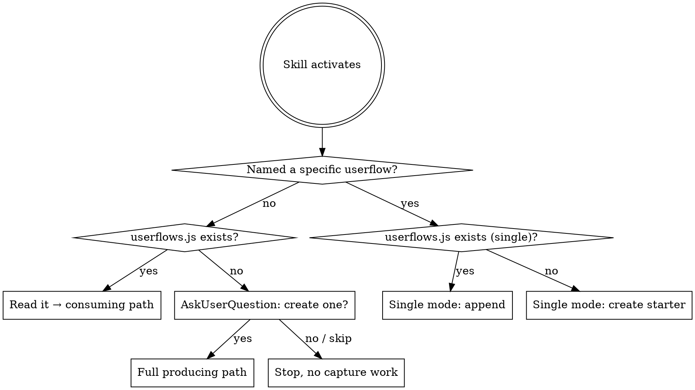

# userflow-capture

Document an app as a map of **user journeys** — the paths a real person takes through the product. Two side-by-side files:

```
docs/
  userflows.html   ← drop-in viewer (unmodified template)
  userflows.js     ← project data (defines window.USERFLOWS)
```

The HTML is for humans — an interactive swimlane diagram you can click through. The JS file is for future LLM agents — they read it before touching a feature or bugfix so they know what the *user* is trying to accomplish, not just what the code does.

Both files live next to each other. The HTML loads `./userflows.js` with a plain `<script src>`, so the page works on `file://` — double-click to open, no server.

**This is not an architecture diagram.** Lanes are not "Server / Database / API". Nodes are not Firestore tables or background jobs. Steps are not HTTP payloads. If a userflow has no user touchpoint — a cron job, a webhook, a data migration — it does not belong here.

## Entry routine — run this first, every time



**Step 0 — Did the user name a specific userflow?** Check the prompt for single-flow intent:
- Explicit arg: `/userflow-capture onboarding`
- "Just" / "only" phrasing: *"document just our checkout"*, *"only the signup flow"*
- Single-flow nouns in the request: *"capture our onboarding"*, *"document our login flow"*
- Forward-looking design: *"plan our v2 onboarding"*, *"design the new checkout"*, *"we're building..."*

If yes → jump to **Single userflow mode** below (it handles file-existence and source-of-truth internally). If no → continue with the full-capture routine.

**Step 1 — Look for the file.** Run:
```bash
find . \( -name userflows.js -o -name userflows.json -o -name userflows.html -o -name flowcap.html \) -not -path '*/node_modules/*' -not -path '*/.git/*' 2>/dev/null | head
```
(Also matches legacy filenames from earlier versions of this skill. Treat any hit as "a userflow capture exists here".)

**Step 2a — Found it.** Read it whole. Jump to *Consuming* below. Do **not** ask first; just read it and let it inform your answer.

**Step 2b — Not found.** Before doing any other work, use the **AskUserQuestion** tool to ask whether to create one. Use this exact shape — one question, three options:

- **Question:** "No `userflows.js` found in this repo. Want me to map the main user journeys now and drop `docs/userflows.html` + `docs/userflows.js` into the repo?"
- **Header:** `userflow setup`
- **Options:**
  1. **Yes, build it now** — *"I'll propose 3–6 user journeys (signup, key feature, settings, etc.), then write both files."*
  2. **Not now, just this task** — *"Skip it. Answer my current question without it."*
  3. **Never for this repo** — *"Don't ask again in this repo."* (When chosen, drop a `.userflow-capture-skip` sentinel file at the repo root so future invocations honor it.)

**Step 3 — Honor the answer.**
- *Yes* → jump to *Producing*.
- *Not now* → continue with whatever the user originally asked, no capture artifacts.
- *Never* → write `.userflow-capture-skip` (empty file at repo root), then continue. On future activations, treat presence of `.userflow-capture-skip` as "user said no, do not ask again" and proceed without capture.

**Don't skip the ask.** Producing a userflow capture is a non-trivial write (two new files, repo-wide reading). It must be user-initiated.

## When to use

- The user asks to document, map, or explain the main userflows in an app.
- The user references this skill by name (`/userflow-capture`, "capture the userflows", "map the user journeys").
- You're starting work in a repo that already has `userflows.js` — read it first so you understand what the user is trying to *do*, not just what the code does.
- You're planning a feature or fixing a bug and the affected screen/journey is listed in `userflows.js` — load that userflow into context.

**Don't use for:**
- Architecture or system diagrams — use Mermaid or a dedicated tool.
- Backend pipelines, cron jobs, webhook chains — those aren't user journeys.
- Single-component explanations or one-function sequence diagrams.

## Producing — generate userflow files for a project

The output is **two files in `docs/`**: the viewer (`userflows.html`) and the data (`userflows.js`). No build step, no server, no generators. Copy the template verbatim, write the data file by hand.

1. **Detect platforms before picking journeys.** Many projects ship more than one app (e.g. a Next.js web app *and* an Expo iOS app in a monorepo). Userflows often differ across platforms — signup steps, screens, and notifications all change — so capturing them under one flat list muddles the doc. Quickly scan for app types:
   - **Web** — `next.config.*`, `vite.config.*`, `astro.config.*`, `remix.config.*`, or `package.json` deps `next` / `vite` / `react-scripts`
   - **Expo / React Native** — `app.json` containing `"expo"`, `app.config.*`, `expo` in package.json deps; bare RN adds `react-native.config.*`, `metro.config.*`, `ios/` + `android/` dirs
   - **iOS native** — `*.xcodeproj`, `*.xcworkspace`, `Podfile`
   - **Android native** — `app/build.gradle`, `gradlew`
   - **Flutter** — `pubspec.yaml`

   If **more than one platform is detected**, use **AskUserQuestion**. Question: *"Detected {comma-separated list of platforms}. Capture userflows for which?"* Options (pick the relevant 3 based on what was detected): **All, grouped by platform** / **{Platform A} only** / **{Platform B} only**. If only one platform is detected (or none clearly), skip the question and proceed.

   **When capturing multiple platforms**, set `platform` on each flow (e.g. `"platform": "Web"`, `"platform": "iOS"`). The viewer groups the sidebar nav by these labels and adds a matching eyebrow above each section's H2. The same flow title can repeat under different platforms — just use distinct `id`s like `onboarding-web` and `onboarding-ios`.

2. **Pick the journeys.** A userflow is something a real user *does*. **Name each userflow using the standard taxonomy in `references/userflow-types.md`** (Onboarding, Creating Account, Editing Profile, Purchasing & Ordering, Sharing, Resetting Password, etc.). Only invent custom names when no standard fits, and mimic the imperative-gerund voice of the list. Aim for **3–6 userflows per platform** that together cover the product's reason for existing. If you can't find user-visible userflows by reading routes, screens, and entry points — **ask the user** which journeys matter. Do not invent userflows from backend code.
3. **List user-facing surfaces as lanes.** Lanes group nodes by where the user is. Examples: `Marketing site → Sign-up → Onboarding → Main app → Settings → Email/Push`. Keep lanes at the **product-surface** level. Never use lanes like "Server", "Database", "Functions" — those are tech locations, not user locations.
4. **List nodes the user actually encounters.** Each node is a screen, modal, decision point, push notification, or email — anything with a user-visible surface. Title is what a user would call it (`Sign up screen`, `Today tab`, `Welcome email`), not what a developer would call it (`SignUpForm.tsx`).
5. **Write each userflow as steps the user takes.** Each step is `{from, to, label, description}`:
   - `from` / `to` — node ids (the user moves from one surface to another, or stays put and triggers something)
   - `label` — the action in plain language: *"Tap **Get started**"*, *"Enter email and password"*, *"Confirm payment"*
   - `description` — one sentence in the user's voice or third-person POV, describing what they see/do. **Optionally append a code pointer after `—` for LLM debugging context.** Example: *"User taps **Save** in the editor — `app/editor/page.tsx`, calls `useSaveEntry()`."*
6. **Find or ask for the product logo (optional but recommended).** A logo in the header makes the doc feel like the product's, not a generic template. The viewer renders it as a white silhouette above the title via `filter: brightness(0) invert(1)`, so any mono or multi-color logo works.
   - **Auto-detect** common spots:
     ```bash
     find . -maxdepth 4 \( -name "logo.svg" -o -name "logo.png" -o -name "logo.jpg" \
       -o -name "logo-light.svg" -o -name "logo-dark.svg" -o -name "icon.svg" \) \
       -not -path "*/node_modules/*" -not -path "*/.git/*" -not -path "*/dist/*" \
       -not -path "*/build/*" -not -path "*/.next/*" 2>/dev/null | head
     ```
     Look in `public/`, `assets/`, `src/assets/`, `app/`, `brand/`, `branding/`, `static/`.
   - **Found one or more?** Use **AskUserQuestion** to confirm. Question: *"Use `<path>` as the userflows header logo?"* Options: **Yes**, **Pick a different path**, **Skip (text-only title)**.
   - **Found nothing?** Use **AskUserQuestion**: *"No product logo found in the usual spots. Provide a path, or skip?"* Options: **Provide path**, **Skip**.
   - **Embed it into `project.logo`** (single-file artifact, no external refs):
     - **SVG:** read the file and paste the raw SVG markup as the string value of `project.logo`. Inline SVG keeps the artifact crisp at any zoom.
     - **PNG / JPG:** base64-encode and set `project.logo` to `"data:image/png;base64,…"` (or `image/jpeg`). The artifact stays self-contained.
   - Skipping is fine — the text title reads cleanly on its own.
7. **Write the two files.** Place both at the project's docs root:
   ```
   docs/userflows.html   ← copy of template.html, unmodified
   docs/userflows.js     ← project data, exactly this shape:
                            window.USERFLOWS = { /* validated against schema.json */ };
   ```
8. **Preview.** Open the file directly — `open docs/userflows.html` on macOS, or double-click. It works on `file://`; no server needed. Click each userflow and verify the steps read like a real person moving through the app, not like a backend trace.

Source files in this skill:
- `template.html` — drop-in viewer. **Do not edit the viewer logic unless the user asks for a visual change.**
- `schema.json` — JSON Schema for the object inside `window.USERFLOWS`. Validate against it.
- `example.userflows.js` — reference example (Quill, a fictional journaling app). Use as a model for the shape and *the voice* of `userflows.js`.
- `references/userflow-types.md` — standard userflow-name taxonomy organized by category (New User Experience, Account Management, Commerce & Finance, Social, Content, Misc). **Read this before naming userflows.**

## Single userflow mode

Triggered when the user names a specific userflow in their prompt (or invokes `/userflow-capture <flow-name>`). Useful for adopting the skill incrementally inside a larger project, or for sketching a userflow you're planning to build before writing code. This mode produces or updates exactly **one** userflow — not 3–6.

Two axes determine what happens:

### Output: append vs. create starter

Branch on whether `userflows.js` already exists in the repo:

- **`userflows.js` already exists → append.** Read the file, parse the `window.USERFLOWS = { ... }` object (it's JSON-compatible — strip the assignment prefix and trailing `;`, then `JSON.parse`). Add the new userflow to the `flows` array, and append any new nodes (and any new lanes those nodes reference) to the `nodes` and `lanes` arrays — **dedupe by `id`**, never duplicate existing entries. Write the file back as `window.USERFLOWS = ${JSON.stringify(...)};`. The HTML stays untouched — it's a drop-in viewer.
  - **Id collision** (a userflow with this id already exists): use **AskUserQuestion** — *"A userflow with id `<id>` already exists. Replace it / Add as a new one with id `<id>-v2` / Cancel."*

- **`userflows.js` doesn't exist → create starter.** Write a fresh `docs/userflows.js` and `docs/userflows.html` (copy of `template.html`, unmodified) with just this one userflow. The user can grow the file later by re-invoking with another flow name — the next call will be in append mode.

### Source: extract vs. plan

Branch on whether the userflow already exists in the codebase:

- **Extract existing.** The flow is implemented. Read routes, screens, components, and entry points to build the steps from real code — same procedure as full-capture's steps 2–5 (Pick the journey → Lanes → Nodes → Write the steps), but narrowed to just this one userflow.

- **Plan new.** The flow doesn't exist yet (forward-looking design — v2 onboarding, a new checkout, a redesigned settings screen). Take the user's description as input. Use **AskUserQuestion** liberally to fill gaps: *"What screens does the user pass through?"*, *"What's the entry point — a push, a link, a button in settings?"*, *"What's the final destination — a success screen, return to home, an email confirmation?"*. **Don't pretend to extract from code that isn't there yet** — the value of a planned userflow comes from honest design intent, not fabricated detail.

If which one applies is unclear, ask: *"Is this an existing flow you want documented, or are you planning a new one?"*

### Procedure summary

1. **Detect intent** (from the entry routine — single-flow mode was triggered).
2. **Pick source.** Extract from code, or plan from user input. Ask if ambiguous.
3. **Logo + platform** (only if create-starter and the user mentions them — when appending, inherit `project.logo` and any `platform` convention from the existing file).
4. **Build the one userflow** following Producing steps 2–5 (Pick the journey → Lanes → Nodes → Steps), scoped to just this flow. Name it using `references/userflow-types.md`.
5. **Write**:
   - *Append mode:* parse existing `userflows.js`, merge in the new flow + any new nodes/lanes, write back.
   - *Create-starter mode:* write `docs/userflows.js` (one flow) + `docs/userflows.html` (template copy).
6. **Preview** with `open docs/userflows.html`.

## Consuming — when `userflows.js` already exists

Before planning a feature, fixing a bug, or answering "how does X work" in this repo:

1. **Locate it.** `find . \( -name userflows.js -o -name userflows.json \) -not -path '*/node_modules/*' | head`.
2. **Read it whole.** It's compact by design. The file is a single statement: `window.USERFLOWS = { ... };` — the object literal is JSON-compatible, so you can treat it as JSON.
3. **Find the affected journey.** If the user's task touches a screen, modal, email, or other node listed in any userflow, that userflow is required context — quote the relevant step description when explaining your plan or fix. This anchors your work to what the user is actually trying to do.
4. **Update it when the user-visible behavior changes.** If a PR renames a screen, adds a step in the signup journey, splits a userflow, or introduces a new touchpoint, edit `userflows.js` in the same PR. Stale userflow docs are worse than missing ones. (Pure backend refactors that don't change what the user sees do not require updates.)

## Schema quick reference

The object assigned to `window.USERFLOWS` (validated by `schema.json`):

```jsonc
{
  "project":  { "name": "...", "description": "...", "logo": "<svg …>…</svg>" },
  "defaults": { "autoSelectFirst": true },
  "lanes":    [ { "id": "onboarding", "label": "Onboarding", "color": "#34d399" } ],
  "nodes":    [ { "id": "welcome", "lane": "onboarding", "title": "Welcome screen", "subtitle": "name + intro" } ],
  "flows":    [ {
    "id": "onboarding-web",
    "title": "Onboarding",
    "platform": "Web",                          // optional: groups sidebar by platform
    "description": "A new visitor creates an account and lands on the Today screen.",
    "steps": [
      { "from": "landing", "to": "signup", "label": "Tap 'Get started'",
        "description": "User clicks the primary CTA on the marketing landing page." }
    ]
  } ]
}
```

All ids are kebab-case `^[a-z0-9-]+$`. Lane order = column order in the diagram. Steps reference nodes by id. The `platform` field is optional — set it on every userflow if the project captures multiple platforms (Web, iOS, Android, Expo, etc.); omit it everywhere for a single-platform flat list.

## Writing good step descriptions

Step descriptions should read like a UX walkthrough, not a stack trace.

**Good:**
- *"User taps **Sign up** on the landing page; Clerk modal appears."*
- *"User enters the 6-digit code from email and taps **Verify**."*
- *"App shows a generating-spinner with the message 'Crafting your first episode…' for ~30 seconds."*
- *"Push notification arrives at 8pm: 'Time for your daily entry'."*

**Bad** (system POV, no user):
- *"Webhook fires `POST /api/clerk/user.created`."*
- *"`prepareNewBuild()` is invoked with `{ appId, appVersion }`."*
- *"Convex mutation `users.create` runs."*

If you need to surface code references for LLM debugging context, append them after an em dash:

> *"User taps **Save** in the editor — `app/editor/page.tsx`, calls `useSaveEntry()` → Convex `entries.create`."*

The user-facing description comes first. The code pointer is a footnote.

## Common mistakes

- **Mapping backend pipelines instead of user journeys.** A cron job that generates content overnight is not a userflow. A webhook chain is not a userflow. A userflow is what a *person* does, sees, taps, reads, or receives. If no user is on the other end of any step, delete the userflow.
- **Fan-out from a single node (screen-affordance dump).** When a node has 4+ outgoing edges to distinct new destinations, you're documenting a screen's *affordances* — everything it can do — instead of a *journey* (what the user does in sequence). Cap outgoing edges at **2 per node** (3 in rare cases). If "Profile screen" branches to Claim, GitHub editor, Category picker, Public view, *and* Email — that's five separate userflows, not one with five branches. The diagram blows out past the container; the reader can't tell what's actually happening. Available actions on a screen belong in the source node's `subtitle`, not as outgoing arrows.
- **Wide-and-shallow flows.** A userflow should read top-to-bottom — most of its mass vertical. If the grid hits 4+ columns at the same tier, the capture has turned into a screen map. Pick the one journey the user is on right now ("Claim profile", "Change GitHub handle", "Update category"), give it its own userflow with its own id, and repeat for each goal. Short and tall beats sprawling and wide every time.
- **Inventing overly specific userflow names when a standard taxonomy entry fits.** "Sign up and finish onboarding then receive the first push notification" is a custom mouthful for what's just **Onboarding**. Check `references/userflow-types.md` first; the product-specific detail belongs in the userflow's `description` field, not the title.
- **Pointing `project.logo` at an external URL or relative path that won't resolve.** The artifact is meant to open by double-click and survive AirDrop, Slack uploads, and email. Embed the logo inline as SVG markup or a base64 data URL. If you must use a relative path, only do so when the file will ship alongside `userflows.html` (and even then, prefer inlining).
- **Lanes as tech locations.** "Server", "Functions", "Database", "External APIs" are wrong. Use product surfaces: "Marketing", "Sign-up", "Onboarding", "Main app", "Settings", "Email/Push".
- **Nodes that aren't user-visible.** A Firestore collection, a queue, an internal function — none of these belong as nodes. Screens, modals, emails, push notifications, in-app banners, decision points the user encounters — those are nodes.
- **Step descriptions written from the system's POV.** Rewrite "Convex emits an event" as "User taps Save; app confirms the entry was saved." If you can't rephrase a step in the user's voice, the step probably doesn't belong in this file.
- **Too many userflows.** 3–6 well-chosen journeys beat 12 partial ones. Cover the product's reason for existing — the rest is noise.
- **Putting the HTML and JS in different folders.** They must be siblings. The viewer references `./userflows.js`; if the JS lives elsewhere, the page won't load it.
- **Editing `template.html` viewer logic to tweak per-project styling.** Don't. If you truly need a visual tweak, add a small `<style>` override at the bottom of the project's `userflows.html` — leave the script logic alone.
- **Writing helper scripts to generate the output.** The entire output is two files — viewer + data. Write the data by hand. No codegen.
- **Inventing userflows.** If you can't find a user-facing journey by reading routes, screens, and entry points, ask the user. Made-up journeys poison every future agent that loads them.
